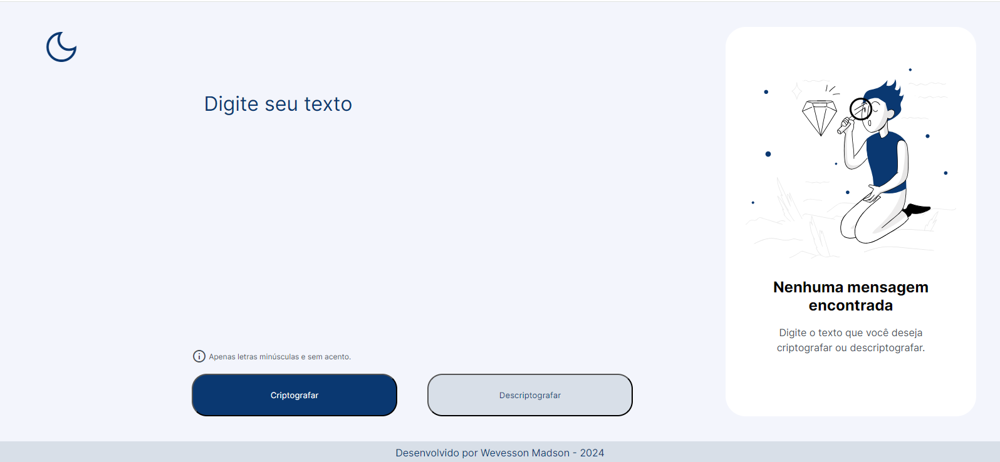
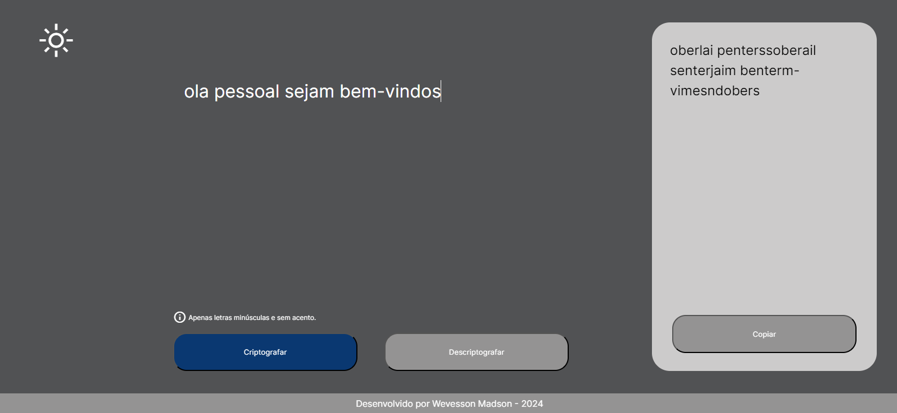
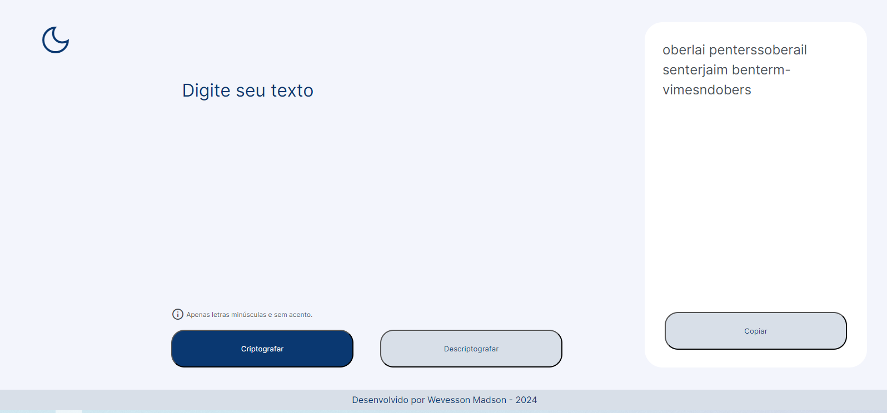
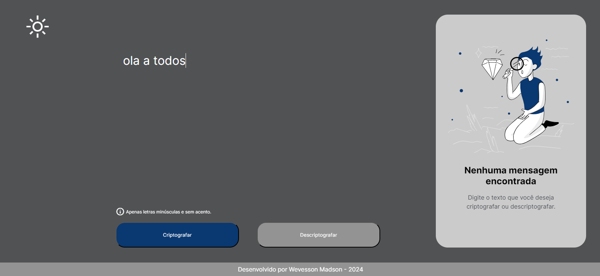

# Decodificador de texto

Desafio de projeto proposto pela [Alura](https://www.alura.com.br/)

Neste desafio foi solicitado o desenvolvimento de uma página que permitisse digitar textos e usar botões para criptografar a mensagem.

A mensagem encriptada deveria aparecer na caixa de resultado, que então pode ser copiada e enviada.

A pessoa que receber a mensagem pode entrar na mesma página, de outro dispositivo, e descriptografar esta e entender o que esta quer informar.

## 🛠 Tecnologias:
  
  
  

## Funcionalidades:

- Encriptar mensagem;
- Decodificar mensagem;
- Copiar resultado;

Extra:

- Dark mode;

## Controle de versionamento:

- Git e Github

## Deploy:

- Github pages;

[Visitar Decodificador](https://wevessonmadson.github.io/decodificador/)

## screenshots:

  
  
  
  
